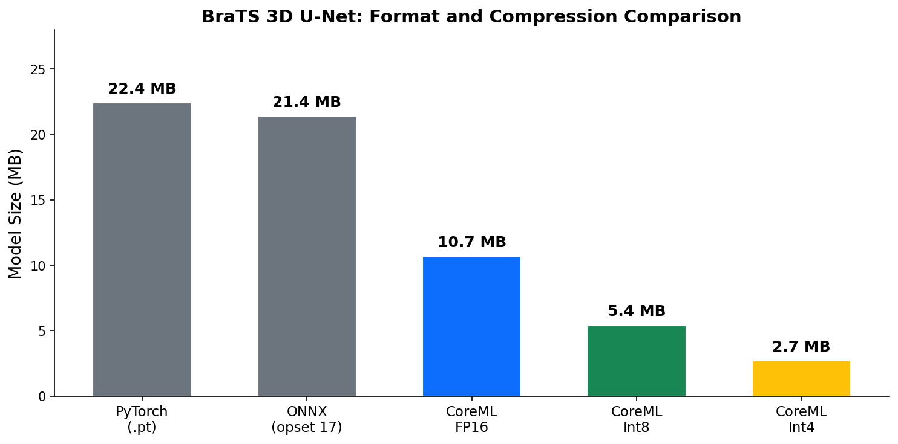

# brats-coreml-swift

CoreML conversion and Swift inference wrapper for the BraTS 2020 3D U-Net. Converts a PyTorch checkpoint to CoreML with optional weight palettization(FP16, Int8, Int4) and wraps it in a Swift Package for macOS inference.



## Model

3D U-Net, 5.6M parameters, 32 base filters, 3 encoder levels. Trained on BraTS 2020 with Dice + cross entropy loss for 200 epochs. Best foreground Dice: 0.7317 on the validation set.

Input: `[1, 4, 128, 128, 128]` (FLAIR, T1, T1ce, T2), z-score normalized on nonzero voxels.
Output: `[1, 4, 128, 128, 128]` (background, NCR/NET, edema, enhancing tumor).

| Variant | Size | Compression | Notes |
|---------|------|-------------|-------|
| PyTorch .pt | ~22.4 MB | baseline | float32 |
| ONNX (opset 17) | 21.4 MB | 1.0x | float32 |
| CoreML FP16 | 10.7 MB | 2.0x | default mlprogram precision |
| CoreML Int8 | 5.4 MB | 4.0x | 8 bit weight palettization |
| CoreML Int4 | 2.7 MB | 8.0x | 4 bit weight palettization |

The Int4 variant is included in this repo under `models/`. FP16 and Int8 can be regenerated with the conversion script.

## Conversion

Requires Python 3.10+, PyTorch, and coremltools. Works on Linux (Colab) or macOS.
```bash
pip install -r convert/requirements.txt
python convert/convert_to_coreml.py \
    --checkpoint /path/to/brats_ckpt_epoch150.pt \
    --output-dir ./models
```

This produces three .mlpackage variants (FP16, Int8, Int4) with metadata baked in.

Note: coremltools no longer supports ONNX as a conversion source. The script loads the PyTorch checkpoint directly, traces the model with `torch.jit.trace`, and converts the TorchScript to CoreML. The ONNX file is not used.

### Conversion pipeline
```
PyTorch checkpoint (.pt)
        |
  torch.jit.trace()
        |
  coremltools.convert()
        |
        +--- FP16  (10.7 MB)
        +--- palettize_weights(nbits=8) --- Int8  (5.4 MB)
        +--- palettize_weights(nbits=4) --- Int4  (2.7 MB)
```

CoreML renames the output tensor to `var_356` internally. The script renames it back to `segmentation` after conversion.

## Swift library

Swift Package Manager library targeting macOS 13+. Two source files:

`Preprocessing.swift`: z-score normalization (matching the Python training pipeline) and MLMultiArray construction.

`BraTSModel.swift`: model loading (from .mlpackage or compiled .mlmodelc), inference, argmax postprocessing, and per class voxel counts.

### Usage
```swift
import BraTSCoreML

let segmenter = try BraTSSegmenter(mlpackageURL: modelURL)

var data: [Float] = loadYourMRIData() // flat [4 * 128 * 128 * 128], CDHW order
VolumeNormalizer.zScoreNormalize(&data)

let result = try segmenter.predict(data: data)
let labels = result.labelMap       // [Int32], length 128*128*128
let counts = result.classCounts    // ["background": N, "NCR/NET": N, ...]
```

### Building
```bash
swift build
swift test
```

The integration test (actual model inference) is skipped on CI because CoreML's 3D convolution compilation segfaults on GitHub Actions runners. It runs on a real Mac.

## Tests

5 tests total:

| Test | What it checks |
|------|----------------|
| testZScoreNormalizationOnNonzeroVoxels | per channel normalization, zeros stay zero |
| testZScoreNormalizationAllZeros | edge case, no NaN or crash |
| testMultiArrayBuilderShape | output MLMultiArray has correct 5D shape |
| testMultiArrayBuilderDataIntegrity | values survive the copy into MLMultiArray |
| testRealModelLoadAndPredict | loads Int4 model, runs inference, checks output shape and label range (skipped on CI) |

## Related

[neuro-lesion-cpp](https://github.com/GuillaumeEsclozas/neuro-lesion-cpp): C++ ONNX Runtime inference pipeline for the same model, with full volume validation results.

## License

Pipeline code provided as is. The model and training data are subject to the BraTS 2020 challenge license.
